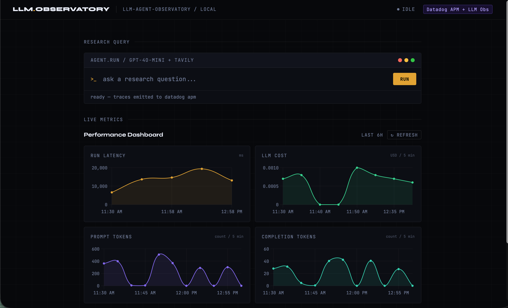
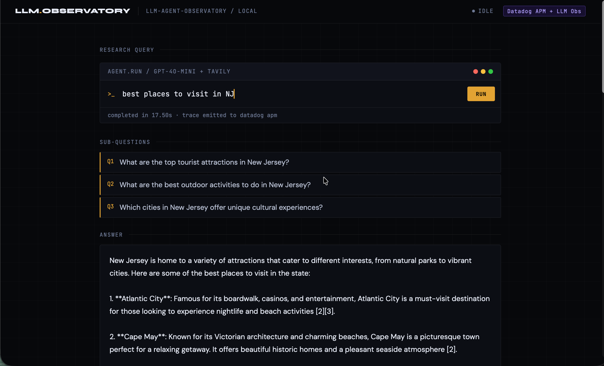
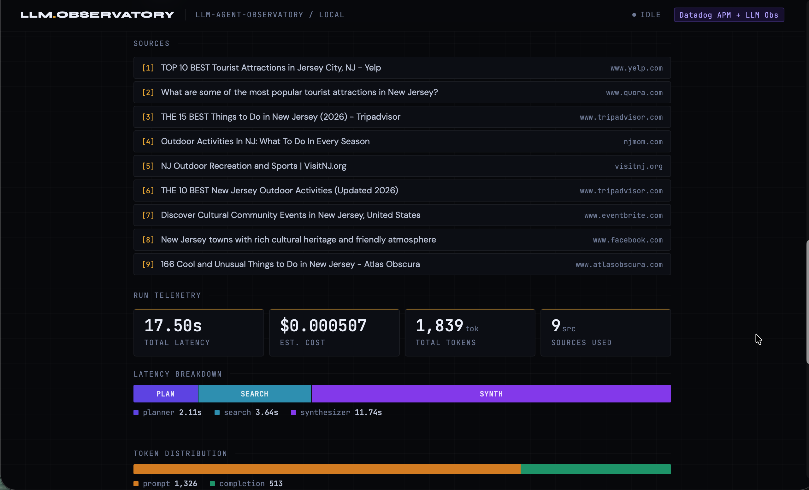
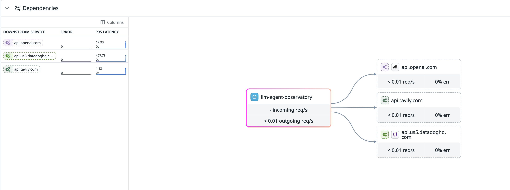
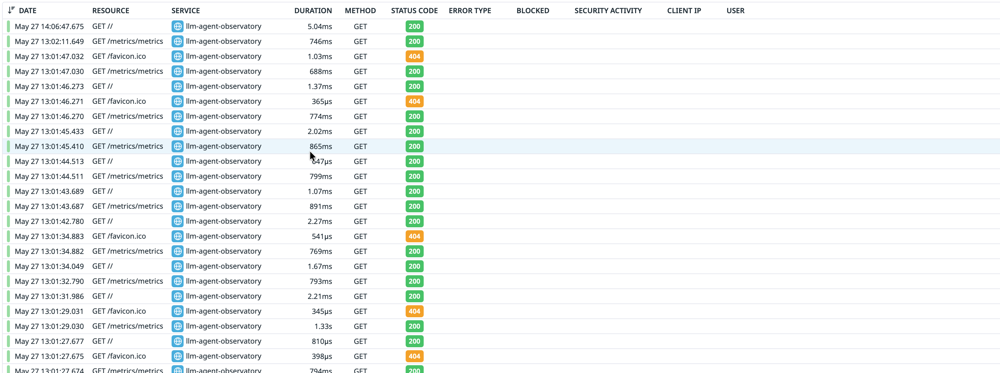

# LLM Agent Observatory

A research agent built on GPT-4o-mini and Tavily, fully instrumented with Datadog APM and LLM Observability. Ask it a question, it breaks it into sub-questions, searches the web, and synthesizes a cited answer. Every step emits traces, spans, and custom metrics.

## What I learned

I wanted to understand how APM actually works under the hood, not just point a library at an app and call it done. So I manually created spans, tagged them with useful metadata, and used LLM Observability to capture the full prompt/response cycle with token counts. Getting DogStatsD hooked up and then pulling those metrics back through the Metrics API to render live charts in the UI was the part that clicked for me - you can see cost and latency trending in real time as you run queries.

## Screenshots

Live performance dashboard - latency, cost, and token charts pulled from the Datadog Metrics API:


Query results - sub-questions the agent generated and a synthesized answer with inline citations:


Run telemetry - source list, latency breakdown by step, token distribution:


Datadog APM service dependencies - llm-agent-observatory calling OpenAI, Tavily, and the Datadog API:


Datadog APM trace list


## How it works

```
User Query
    |
    v
+--------------------------------------------------+
|                  Research Agent                  |
|                                                  |
|  +----------+   +----------+   +-------------+   |
|  |  Planner |-->| Searcher |-->| Synthesizer |   |
|  |  (LLM)   |   | (Tavily) |   |    (LLM)    |   |
|  +----------+   +----------+   +-------------+   |
|       |               |               |          |
|       +---------------+---------------+          |
|                       |                          |
|              Datadog APM Spans                   |
|              LLM Observability                   |
|              Custom Metrics (DogStatsD)          |
+--------------------------------------------------+
                        |
                        v
              Datadog Dashboard
```

1. **Planner** - GPT-4o-mini breaks the question into 2-3 targeted sub-questions
2. **Searcher** - Tavily web search per sub-question, returns top results
3. **Synthesizer** - GPT-4o-mini reads all results and writes a cited answer

Each step is a traced span. The full run is one root trace in Datadog APM.

## Tech stack

| Layer | Tool |
|-------|------|
| Language | Python 3.11+ |
| LLM | OpenAI GPT-4o-mini |
| Web search | Tavily API |
| Observability | Datadog ddtrace + LLM Observability |
| Metrics | DogStatsD |
| Web UI | FastAPI + Jinja2 |
| Packaging | Docker + docker-compose |

## Datadog integration

### APM traces

| Span | Tags |
|------|------|
| `research_agent.run` | `query`, `success`, `latency_ms`, `energy_wh`, `co2_g` |
| `agent.plan` | `sub_question_count`, `prompt_tokens` |
| `agent.search` | `query`, `result_count`, `latency_ms` |
| `agent.synthesize` | `completion_tokens`, `cost_usd` |

### LLM Observability

Every LLM call is captured with full input/output messages, token counts, model name, and error classification on failure.

### Custom metrics (DogStatsD)

| Metric | Type | Description |
|--------|------|-------------|
| `agent.run.latency_ms` | Gauge | End-to-end latency per run |
| `agent.llm.cost_usd` | Gauge | Estimated cost per LLM call |
| `agent.llm.tokens.prompt` | Count | Prompt tokens per call |
| `agent.llm.tokens.completion` | Count | Completion tokens per call |
| `agent.search.result_count` | Gauge | Tavily results per search |
| `agent.run.error` | Count | Failed runs, tagged by error type |
| `agent.env.energy_wh` | Gauge | Estimated energy per run (Wh) |
| `agent.env.co2_g` | Gauge | Estimated CO2e per run (grams) |
| `agent.env.water_ml` | Gauge | Estimated water use per run (mL) |

## Project structure

```
llm-agent-observatory/
├── agent/
│   ├── planner.py          # LLM call: question -> sub-questions
│   ├── searcher.py         # Tavily: sub-question -> search results
│   ├── synthesizer.py      # LLM call: results -> final answer
│   ├── environment.py      # Environmental footprint estimator (energy/CO2/water)
│   └── runner.py           # Orchestrates steps, owns root trace
├── observability/
│   ├── tracing.py          # ddtrace setup and span helpers
│   └── metrics.py          # DogStatsD custom metric helpers
├── api/
│   └── app.py              # FastAPI app, POST /query endpoint
├── templates/
│   └── index.html          # Query form and result display
├── tests/
│   ├── test_planner.py
│   ├── test_searcher.py
│   ├── test_synthesizer.py
│   └── test_runner.py
├── docker-compose.yml      # App + Datadog Agent sidecar
├── Dockerfile
└── .env.example
```

## Setup

### Prerequisites

- Docker and docker-compose
- Datadog account (free trial at datadoghq.com)
- OpenAI API key
- Tavily API key

### Quick start

```bash
# Clone the repo
git clone <repo-url>
cd llm-agent-observatory

# Copy and fill in environment variables
cp .env.example .env

# Start everything
docker-compose up

# Open the UI
open http://localhost:8000
```

### Without Docker

```bash
pip install -r requirements.txt
cp .env.example .env
uvicorn api.app:app --reload --port 8000
```

### Tests

```bash
pytest tests/ --cov=agent --cov=observability --cov-report=term-missing
```

## Environment variables

| Variable | Description |
|----------|-------------|
| `OPENAI_API_KEY` | OpenAI API key |
| `TAVILY_API_KEY` | Tavily search API key |
| `DD_API_KEY` | Datadog API key |
| `DD_APP_KEY` | Datadog application key (for metrics dashboard) |
| `DD_SITE` | Datadog site (e.g. `us5.datadoghq.com`) |
| `DD_SERVICE` | Service name in APM (default: `llm-agent-observatory`) |
| `DD_ENV` | Environment tag (default: `local`) |
| `DD_VERSION` | Version tag (default: `1.0.0`) |

## Cost

At GPT-4o-mini pricing ($0.15/1M input, $0.60/1M output tokens), a typical query costs around $0.001-$0.004.

## Environmental footprint (estimated)

Each query also reports an estimated environmental cost — energy (Wh), carbon (gCO2e), and water (mL) — shown in the run telemetry and emitted as `agent.env.*` metrics.

These are order-of-magnitude estimates, not measurements — OpenAI doesn't publish per-request energy figures. The methodology (constants in `agent/environment.py`):

- **Energy**: linearized from [Epoch AI's estimate](https://epoch.ai/gradient-updates/how-much-energy-does-chatgpt-use) of ~0.3 Wh for a typical GPT-4o query (~500 output tokens), scaled down ~10x for GPT-4o-mini's smaller size. Prompt (prefill) tokens are weighted at 10% of completion (decode) tokens, and a 1.2x datacenter PUE overhead is applied.
- **Carbon**: ~0.4 gCO2e/Wh, near the US grid average carbon intensity.
- **Water**: ~1.8 mL/Wh for on-site cooling plus off-site generation, per [Ren et al., "Making AI Less Thirsty"](https://arxiv.org/abs/2304.03271).

A typical query lands around 30-70 mWh — roughly 10-25 seconds of a 10 W LED bulb.
